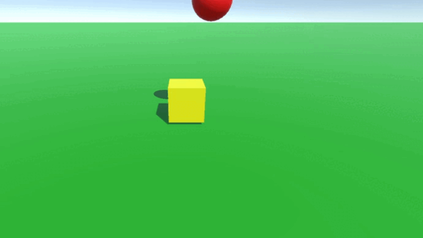
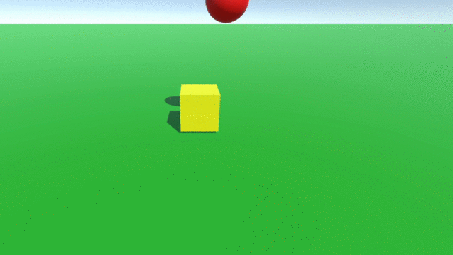
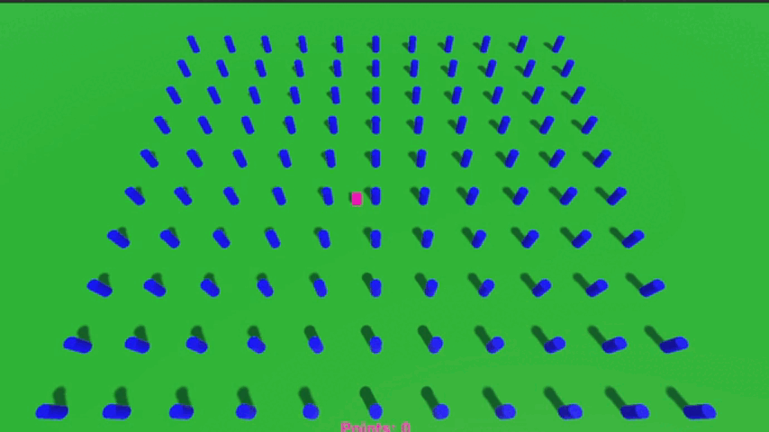
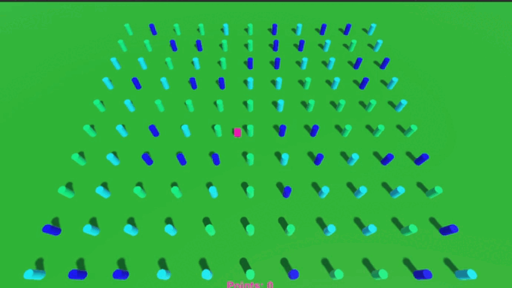
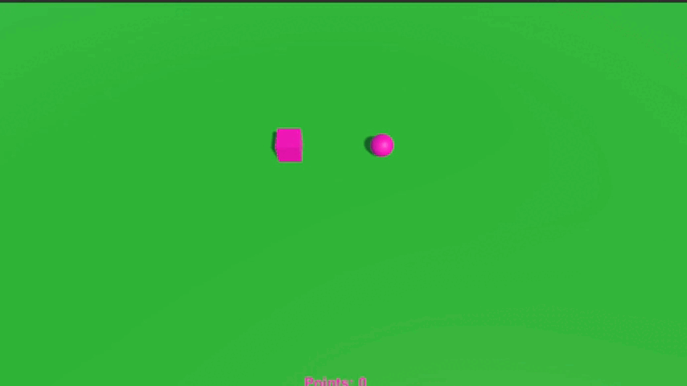

# Pract02-InterfacesInteligentes
 
# Ej 1

* <b>Ni cubo ni esfera tienen física</b>: Se quedan quietos

* <b>Esfera con físicas, cubo sin</b>: Esfera se choca contra el cubo y se mueve, el cubo permanece estático.

* <b>Ambos con físicas</b>: Ambos caen, chocan y reaccionan entre ellos y con el plano.

* <b>Ambos con físicas, esfera con más masa</b>: El cubo reacciona más que la esfera con el choque entre ellos.

* <b>Esfera con físicas, cubo trigger</b>: La esfera pasa a través del cubo. El cubo no se mueve.

* <b>Ambos con físicas, cubo trigger</b>: Ambos reaccionan a la gravedad, pero el cubo no colisiona ni con la esfera ni con el plano.

* <b>Ambos con físicas, esfera con más masa, cubo no se puede rotar en X o Z</b>: El cubo es empujado fuera del camino de la esfera.

# Ej 2

<b>Controlador de jugador cinemático</b>: Movimiento en el plano XZ con las teclas WASD, rotación con las teclas QE.

# Ej 3

* <b>Cilindros que aumentan de tamaño y aumentan la puntuación</b>.

* <b>Cilindros de tipo A que se alejan al pulsar la barra espaciadora</b>.

* <b>Cilindros que se alejan del jugador cuando se acerca el jugador</b>.

* <b>Objeto adicional controlado por IJML, usando físicas</b>. (Cámara estática)

* <b>Cubos que aumentan o disminuyen de tamaño en función de si se le acerca la esfera o el cubo</b>.

